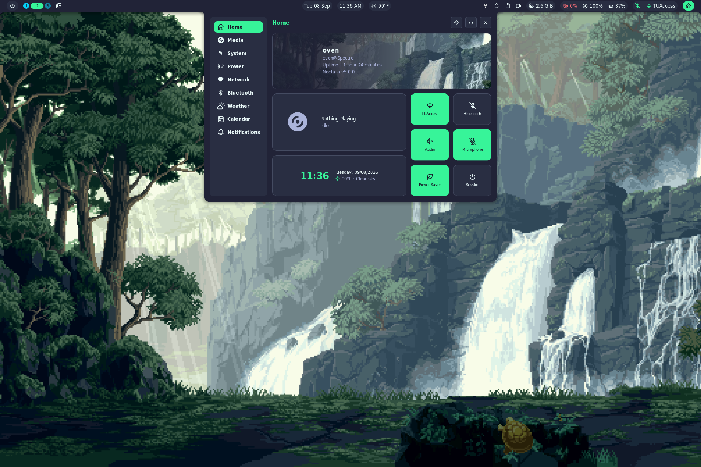
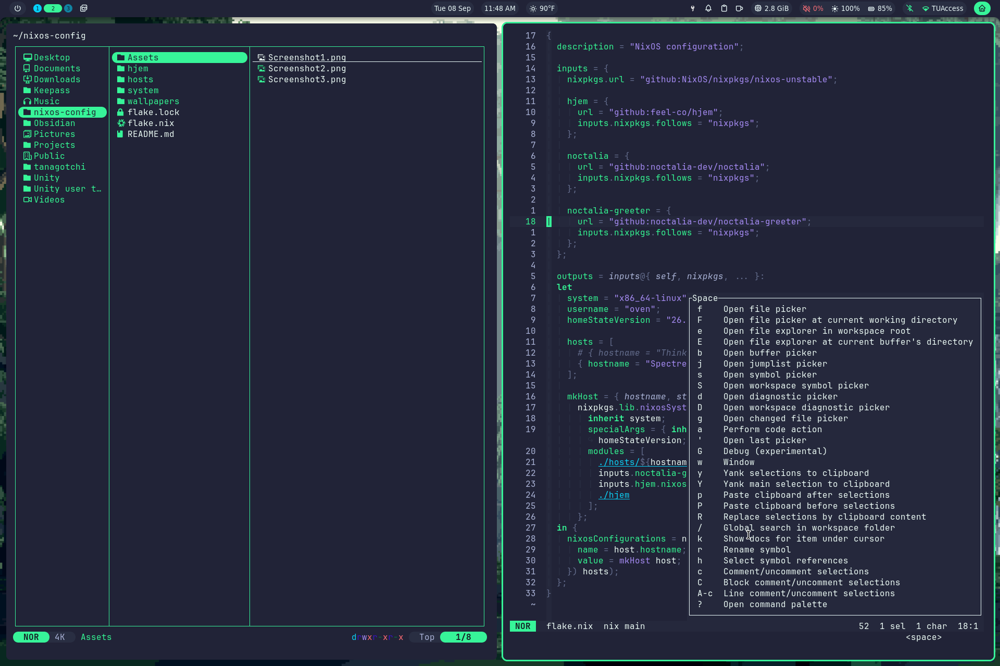

# nixos-config

Personal [NixOS](https://nixos.org) flake configuration for my machines. Shared publicly in case it’s useful as a reference or starting point for your own setup — not meant as a reusable framework.

## Programs and Tools

#### Desktop Environment

| Tool | Description |
|---|---|
| [Noctalia Shell](https://noctalia.dev/) | A customizable desktop shell providing panels, widgets, menus, and other desktop utilities. |
| [Noctalia Greeter](https://docs.noctalia.dev/greeter/) | A graphical login and session-selection greeter for starting desktop sessions. |
| [Niri](https://github.com/niri-wm/niri) | A scrollable-tiling Wayland compositor focused on dynamic window management. |
| [Hyprland](https://hypr.land/) | A highly customizable, dynamic tiling Wayland compositor with extensive configuration options. |

#### Nix Tools

| Tool | Description |
|---|---|
| [NixOS](https://nixos.org/) | A declarative Linux distribution that uses Nix to reproducibly manage the operating system, packages, services, and system configuration. |
| [Hjem](https://github.com/feel-co/hjem) | A lightweight Nix-based tool for declaratively managing user home directories and dotfiles as an alternative to Home Manager. |
| [NH](https://github.com/nix-community/nh) | A modern command-line helper for Nix and NixOS that simplifies system rebuilding, garbage collection, searching, and generation management. |


## Hosts

Multiple machines are defined in `flake.nix` and live under `hosts/`. Each host pulls in shared system modules plus its own hardware config.

Add a host by creating `hosts/<Name>/` (with `default.nix` and `hardware-configuration.nix`) and listing it in the `hosts` array in `flake.nix`.

## Layout

```
.
├── flake.nix          # Flake entry: inputs, host list, nixosConfigurations
├── hosts/             # Per-machine config (hardware + host-specific modules)
│   ├── Spectre/
│   └── ThinkPad/
├── system/            # Shared NixOS modules (boot, net, desktop, user, …)
├── hjem/              # User environment via hjem
│   ├── desktop/       # Wayland/desktop apps & configs (niri, hyprland, ghostty, …)
│   └── shell/         # CLI tools & configs (bash, helix, yazi, starship, …)
└── wallpapers/        # Wallpaper assets
```

- **`hosts/`** — machine-specific: import `../../system` and local `hardware-configuration.nix`.
- **`system/`** — OS-level settings shared across hosts.
- **`hjem/`** — per-user packages and dotfiles, split into `desktop/` and `shell/`.

Rebuild with `nh` (flake path is set to this repo), or the usual `nixos-rebuild` / `nixos-rebuild switch --flake .#<hostname>`.

## Screenshots

 
